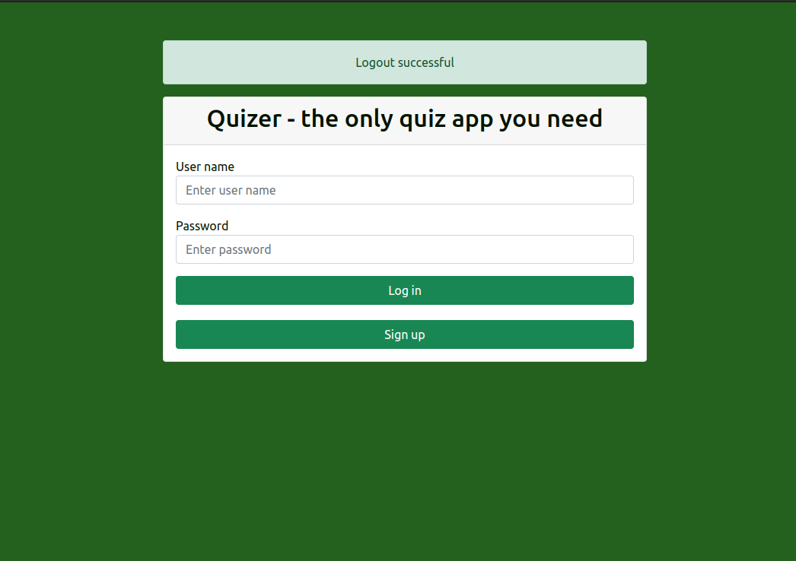
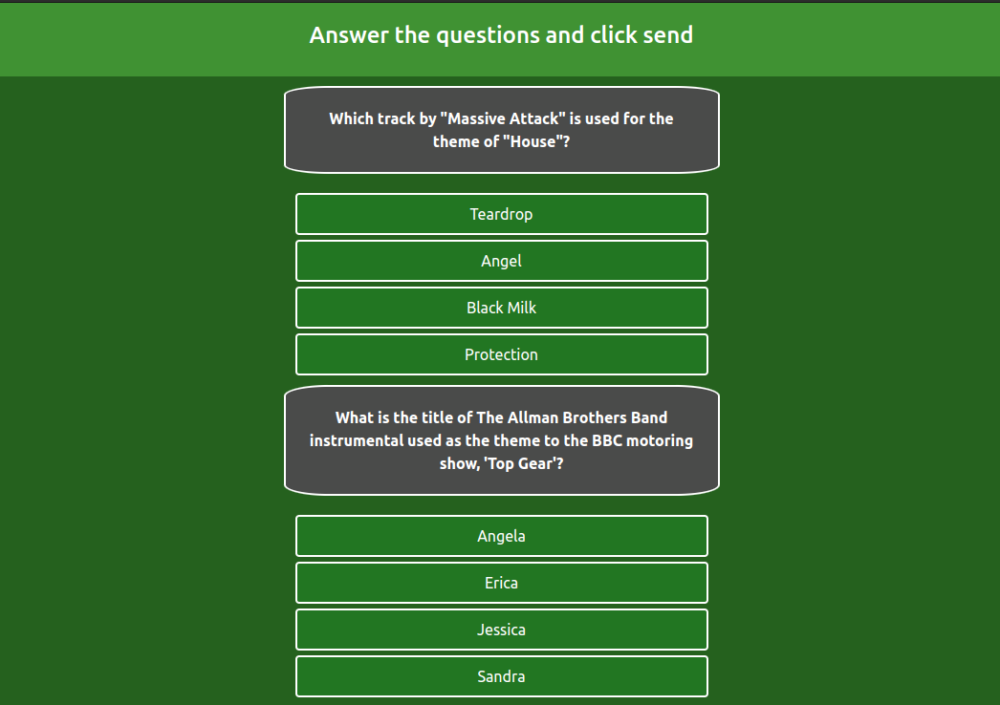
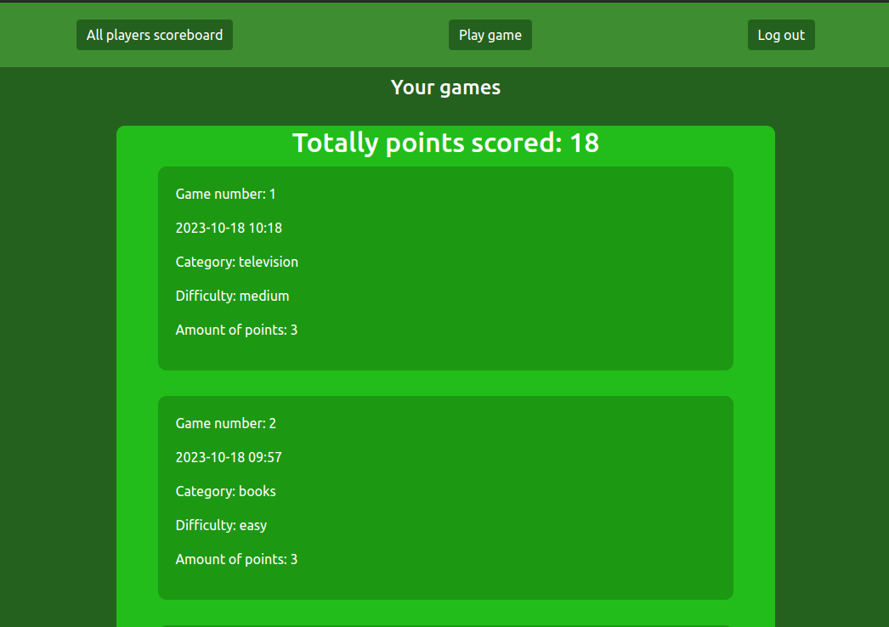

# SpringQuizer

Spring Quizer is a proprietary quizzing application written in java. 
 
The question database comes from a third-party provider like opentdb.com .
 
The application allows registration, login, gameplay, access to the history of your games and the scoreboard of all players. 
Gameplay is based on selecting a category of questions and then choosing a difficulty level: 
easy mode is five boolean questions,
medium mode is ten multi choice questions
and hard mode is 15 multi choice questions.

 
The application exposes restapi allowing to download scoreboards of all players,
a set of questions tailored to the selected category and difficulty,
information about the games of individual players based on userName. Example curl calls
 
 
curl http://3.67.98.254:8190/quizer/api/scoreboard
 
curl http://3.67.98.254:8190/quizer/api/films/easy
 
curl http://3.67.98.254:8190/quizer/api/random/hard
 
curl http://3.67.98.254:8190/quizer/api/game-info/Arczi
 
 
Method of activation:
 
make sure you have docker installed on your environment
 
- clone git repository
 
-build the jar file with koemnd ./gradlew build (on Linux)
 
-docker build -t spring-quizer .
 
- launch the container with the docker compose up -d command
 
-application is available at localhost:8190/quizer
 
 
 
 
Technologies used in the production process:
 
Java, Spring Boot, Spring Security, Postgresql, Thymeleaf, Lombok,Flyway, Api opentdb.com, Wiremock, Rest Assured, Mockito, Docker, AWS,
